# Facio — Operations Dashboard

## Visão geral

Painel interno da Facio que reúne duas ferramentas usadas pelo time de Operations:

1. **Dashboard de Operações** — centraliza links, processos e instruções (grupos, seções e links editáveis).
2. **Árvore de Cobrança** — visualiza o fluxo de decisão de inadimplência (quantos dias em atraso → qual ação tomar).

A tela inicial é um **launcher** com as duas opções no centro. Hospedado na Cloudflare Pages e incorporado via `/embed` no Notion. O controle de acesso é feito pelo próprio Notion — quem tem acesso à página já é da equipe e pode visualizar e editar.

---

## Conceito

```
Equipe acessa o Notion
→ página tem o painel embedado via /embed
→ launcher com 2 cards aparece no centro
→ escolhe Dashboard de Operações OU Árvore de Cobrança
→ usa a ferramenta (visualizar ou editar)
→ salva no Supabase
→ todo mundo vê atualizado em tempo real
→ botão "voltar" retorna pro launcher a qualquer momento
```

---

## Rodando localmente

```bash
cd facio-dashboard
npm install
npm run dev
```

Pré-requisitos:
- `.env` com `VITE_SUPABASE_URL` e `VITE_SUPABASE_ANON_KEY`
- Migrações `supabase/0001_initial_schema.sql`, `0002_seed.sql` e `0003_replace_emoji_icons.sql` aplicadas no Supabase Studio

---

## Permissões

Sem autenticação própria. O Notion já controla quem acessa o quê. Quem tem acesso à página do Notion tem acesso ao dashboard — incluindo o modo de edição.

---

## O que é editável

```
Workspace
└── Nome (ex: "Facio")

Grupos
└── Criar, renomear, reordenar, deletar
    (ex: Atendimento, Gestão, Docs & Time)

Seções
└── Criar, renomear, trocar ícone
└── Mover de grupo
└── Reordenar, deletar
    (ex: Canais críticos, Ferramentas)

Links
└── Criar, editar label, trocar URL
└── Trocar ícone
└── Reordenar, deletar
```

---

## Árvore de Cobrança

Segunda ferramenta do painel. Representa o fluxo de decisão usado pelo time de cobrança da Facio: dado o número de dias de atraso de um cliente, decide qual ação tomar.

**Ações terminais possíveis:**
- Gerar boleto (`charges` no Retool) — atraso 1-28 dias com aceite de pagamento parcial
- Direcionar para parcelamento pelo App em até 4x — atraso de 30 dias
- Oferecer desconto progressivo conforme faixa de atraso:

| Faixa de atraso | Desconto | Multiplicador do valor da contratação |
|---|---|---|
| 60–89 dias | 10% | × 0,90 |
| 90–119 dias | 20% | × 0,80 |
| 120–149 dias | 30% | × 0,70 |
| 150–179 dias | 50% | × 0,50 |
| Acima de 180 dias | 70% | × 0,20 ⚠️ (revisar — esperado × 0,30) |

> ⚠️ A última linha tem inconsistência aritmética no source original (70% off deveria ser × 0,30, mas o flowchart diz × 0,20). Tratar como bug a confirmar com Operations antes do deploy do wizard.

**Modos de uso pretendidos:**
- **Visualização** — qualquer pessoa vê o fluxo completo como diagrama
- **Wizard** — atendente responde "quantos dias em atraso?" e a árvore guia até a ação correta
- **Edição** (futuro) — gestão atualiza faixas e descontos sem mexer em código

### Source do flowchart (Mermaid)

Fonte canônica do fluxo. Será movida para `src/data/collectionFlow.ts` na Sprint 12.

```mermaid
flowchart TD
  nd8906283_0088_45f4_81ee_4b93c348a9bc["Cálculo = Valor da contratação * 0,90"]
  n42241f61_4c4d_4ed9_bbfb_f7a354fa7aa0["Aceitou seguir com o pagamento parcial?"]
  n97e5592e_3855_4e6d_a191_4793ac867749["Quantos dias em atraso?"]
  n7cf69e99_a37f_41d6_8a95_61d8fbb54156["Escolha uma das opções"]
  n7473f25c_0f10_45cf_9820_fd2e9d71a7b1["Desconto 10%"]
  n227197ca_63a6_4b1c_adb2_325198c5877f["Cálculo = Valor da contratação * 0,80"]
  n0faa330d_ed47_4f0e_babb_1d576e59b3d7["Cálculo = Valor da contratação * 0,50"]
  ned0eabcf_a2f1_4bc6_9c1d_4451dac7c0a1["Desconto 70%"]
  n12d56a7a_7561_4a71_8ef1_b60419582032["Cálculo = Valor da contratação * 0,20"]
  nb76eb52d_b19c_4e80_9810_6379f8048f00["Sim. Gerar boleto em #quot;charges no retool#quot; do valor combinado"]
  n2b3bc598_623f_49cb_874a_69d6bca8dc4c["Seguir a proposta de pagamentos parciais - Boleto"]
  nbe9ec4df_a3fb_4075_ad53_1657297c3836["Atraso entre 1 e 28 dias"]
  n415c1181_a9bd_4f75_9f50_bf0a7e087814["Direcionar para o parcelamento pelo App em até 4 vezes"]
  n32bc43b3_3b84_420d_b889_a8a7fb03df79["Desconto 20%"]
  n433cc8c3_29e8_405d_9480_4243dc9c77b7["Desconto 50%"]
  n3322b9c4_bdcd_41eb_825b_57c92afb717b["Desconto 30%"]
  n5d866234_e4eb_4a53_be09_4e679780ff47["60 até 89"]
  n1a38ab5b_7ed4_4cd7_acdf_f026538c5754["Cálculo = Valor da contratação * 0,70"]
  n1d9cb245_5994_4cf5_af70_61cde80c3eb7["90 até 119"]
  n10f63801_a42c_43f1_987d_024897e496f6["30 dias de atraso"]
  n41393af6_a70b_44a9_930e_c8c0924c2275["Não"]
  n6d982f6c_cb61_4ad1_90a0_81dfcd6d5293["120 até 149"]
  n2f5c01a7_65cb_4a3e_ba60_4d22a0ae60b5["Acima de 60 dias"]
  nf8b134aa_a1f2_4467_889a_3e354a2ee7f9["150 até 179"]
  n19e0a104_a85b_49da_bcd0_773e8d0a5dc1["Acima de 180"]

  n7473f25c_0f10_45cf_9820_fd2e9d71a7b1 --> nd8906283_0088_45f4_81ee_4b93c348a9bc
  n2b3bc598_623f_49cb_874a_69d6bca8dc4c --> n42241f61_4c4d_4ed9_bbfb_f7a354fa7aa0
  n2f5c01a7_65cb_4a3e_ba60_4d22a0ae60b5 --> n7cf69e99_a37f_41d6_8a95_61d8fbb54156
  n5d866234_e4eb_4a53_be09_4e679780ff47 --> n7473f25c_0f10_45cf_9820_fd2e9d71a7b1
  n32bc43b3_3b84_420d_b889_a8a7fb03df79 --> n227197ca_63a6_4b1c_adb2_325198c5877f
  n433cc8c3_29e8_405d_9480_4243dc9c77b7 --> n0faa330d_ed47_4f0e_babb_1d576e59b3d7
  n19e0a104_a85b_49da_bcd0_773e8d0a5dc1 --> ned0eabcf_a2f1_4bc6_9c1d_4451dac7c0a1
  ned0eabcf_a2f1_4bc6_9c1d_4451dac7c0a1 --> n12d56a7a_7561_4a71_8ef1_b60419582032
  n42241f61_4c4d_4ed9_bbfb_f7a354fa7aa0 --> nb76eb52d_b19c_4e80_9810_6379f8048f00
  nbe9ec4df_a3fb_4075_ad53_1657297c3836 --> n2b3bc598_623f_49cb_874a_69d6bca8dc4c
  n97e5592e_3855_4e6d_a191_4793ac867749 --> nbe9ec4df_a3fb_4075_ad53_1657297c3836
  n10f63801_a42c_43f1_987d_024897e496f6 ==> n415c1181_a9bd_4f75_9f50_bf0a7e087814
  n1d9cb245_5994_4cf5_af70_61cde80c3eb7 --> n32bc43b3_3b84_420d_b889_a8a7fb03df79
  nf8b134aa_a1f2_4467_889a_3e354a2ee7f9 --> n433cc8c3_29e8_405d_9480_4243dc9c77b7
  n6d982f6c_cb61_4ad1_90a0_81dfcd6d5293 --> n3322b9c4_bdcd_41eb_825b_57c92afb717b
  n7cf69e99_a37f_41d6_8a95_61d8fbb54156 --> n5d866234_e4eb_4a53_be09_4e679780ff47
  n3322b9c4_bdcd_41eb_825b_57c92afb717b --> n1a38ab5b_7ed4_4cd7_acdf_f026538c5754
  n7cf69e99_a37f_41d6_8a95_61d8fbb54156 --> n1d9cb245_5994_4cf5_af70_61cde80c3eb7
  n97e5592e_3855_4e6d_a191_4793ac867749 ==> n10f63801_a42c_43f1_987d_024897e496f6
  n42241f61_4c4d_4ed9_bbfb_f7a354fa7aa0 --> n41393af6_a70b_44a9_930e_c8c0924c2275
  n7cf69e99_a37f_41d6_8a95_61d8fbb54156 --> n6d982f6c_cb61_4ad1_90a0_81dfcd6d5293
  n97e5592e_3855_4e6d_a191_4793ac867749 --> n2f5c01a7_65cb_4a3e_ba60_4d22a0ae60b5
  n7cf69e99_a37f_41d6_8a95_61d8fbb54156 --> nf8b134aa_a1f2_4467_889a_3e354a2ee7f9
  n7cf69e99_a37f_41d6_8a95_61d8fbb54156 --> n19e0a104_a85b_49da_bcd0_773e8d0a5dc1

  style nd8906283_0088_45f4_81ee_4b93c348a9bc fill:#f9fafb,stroke:#e5e7eb,color:#9ca3af,stroke-width:1px
  style n42241f61_4c4d_4ed9_bbfb_f7a354fa7aa0 fill:#f9fafb,stroke:#e5e7eb,color:#9ca3af,stroke-width:1px
  style n97e5592e_3855_4e6d_a191_4793ac867749 fill:#ffffff,stroke:#6366f1,color:#111827,stroke-width:2px
  style n7cf69e99_a37f_41d6_8a95_61d8fbb54156 fill:#f9fafb,stroke:#e5e7eb,color:#9ca3af,stroke-width:1px
  style n7473f25c_0f10_45cf_9820_fd2e9d71a7b1 fill:#f9fafb,stroke:#e5e7eb,color:#9ca3af,stroke-width:1px
  style n227197ca_63a6_4b1c_adb2_325198c5877f fill:#f9fafb,stroke:#e5e7eb,color:#9ca3af,stroke-width:1px
  style n0faa330d_ed47_4f0e_babb_1d576e59b3d7 fill:#f9fafb,stroke:#e5e7eb,color:#9ca3af,stroke-width:1px
  style ned0eabcf_a2f1_4bc6_9c1d_4451dac7c0a1 fill:#f9fafb,stroke:#e5e7eb,color:#9ca3af,stroke-width:1px
  style n12d56a7a_7561_4a71_8ef1_b60419582032 fill:#f9fafb,stroke:#e5e7eb,color:#9ca3af,stroke-width:1px
  style nb76eb52d_b19c_4e80_9810_6379f8048f00 fill:#f9fafb,stroke:#e5e7eb,color:#9ca3af,stroke-width:1px
  style n2b3bc598_623f_49cb_874a_69d6bca8dc4c fill:#f9fafb,stroke:#e5e7eb,color:#9ca3af,stroke-width:1px
  style nbe9ec4df_a3fb_4075_ad53_1657297c3836 fill:#f9fafb,stroke:#e5e7eb,color:#9ca3af,stroke-width:1px
  style n415c1181_a9bd_4f75_9f50_bf0a7e087814 fill:#dcfce7,stroke:#16a34a,color:#14532d,stroke-width:3px
  style n32bc43b3_3b84_420d_b889_a8a7fb03df79 fill:#f9fafb,stroke:#e5e7eb,color:#9ca3af,stroke-width:1px
  style n433cc8c3_29e8_405d_9480_4243dc9c77b7 fill:#f9fafb,stroke:#e5e7eb,color:#9ca3af,stroke-width:1px
  style n3322b9c4_bdcd_41eb_825b_57c92afb717b fill:#f9fafb,stroke:#e5e7eb,color:#9ca3af,stroke-width:1px
  style n5d866234_e4eb_4a53_be09_4e679780ff47 fill:#f9fafb,stroke:#e5e7eb,color:#9ca3af,stroke-width:1px
  style n1a38ab5b_7ed4_4cd7_acdf_f026538c5754 fill:#f9fafb,stroke:#e5e7eb,color:#9ca3af,stroke-width:1px
  style n1d9cb245_5994_4cf5_af70_61cde80c3eb7 fill:#f9fafb,stroke:#e5e7eb,color:#9ca3af,stroke-width:1px
  style n10f63801_a42c_43f1_987d_024897e496f6 fill:#ffffff,stroke:#6366f1,color:#111827,stroke-width:2px
  style n41393af6_a70b_44a9_930e_c8c0924c2275 fill:#f9fafb,stroke:#e5e7eb,color:#9ca3af,stroke-width:1px
  style n6d982f6c_cb61_4ad1_90a0_81dfcd6d5293 fill:#f9fafb,stroke:#e5e7eb,color:#9ca3af,stroke-width:1px
  style n2f5c01a7_65cb_4a3e_ba60_4d22a0ae60b5 fill:#f9fafb,stroke:#e5e7eb,color:#9ca3af,stroke-width:1px
  style nf8b134aa_a1f2_4467_889a_3e354a2ee7f9 fill:#f9fafb,stroke:#e5e7eb,color:#9ca3af,stroke-width:1px
  style n19e0a104_a85b_49da_bcd0_773e8d0a5dc1 fill:#f9fafb,stroke:#e5e7eb,color:#9ca3af,stroke-width:1px
```



---

## Stack

| Camada | Tecnologia | Motivo |
|---|---|---|
| Frontend | React + TypeScript | Estado complexo, modo edição inline, base para o chatbot |
| Build | Vite | Já na stack, dev server rápido |
| Hospedagem | Cloudflare Pages | Já na stack |
| Banco de dados | Supabase | Persistência e sincronização em tempo real |
| Estilo | Tailwind | Agilidade para montar os dois modos (visualização e edição) |
| Ícones | `@tabler/icons-react` | Conjunto consistente de ícones SVG (line) com tree-shaking |
| Automações | Make (Integromat) | Integrações futuras se necessário |

### Por que React + TypeScript e não vanilla JS?

O projeto tem dois modos de interface (visualização e edição) com estado compartilhado e dados vindos de API. Na Fase 3 entra um chatbot, que adiciona mais camadas de estado. Vanilla JS é tecnicamente possível mas vira um problema de manutenção. React + TypeScript resolve de forma limpa desde o início.

### Compatibilidade com /embed do Notion

O Vite gera arquivos estáticos (HTML + CSS + JS). O Notion não sabe que é React — carrega como qualquer URL. JavaScript executa normalmente dentro do iframe, Supabase conecta sem restrições. O botão de edição funciona inline sem precisar abrir nova aba ou mudar de URL.

---

## Arquitetura do projeto

```
facio-dashboard/
├── src/
│   ├── components/
│   │   ├── Sidebar.tsx            # Menu lateral com grupos, seções e edição inline
│   │   ├── PageContent.tsx        # Área de conteúdo principal
│   │   ├── NavItem.tsx            # Item do menu lateral (com slot de ações no hover)
│   │   ├── ItemRow.tsx            # Linha de link clicável
│   │   ├── EditButton.tsx         # Botão que ativa o modo edição
│   │   ├── Icon.tsx               # Resolver Tabler Icons + lista pro picker
│   │   ├── Logo.tsx               # Logo Facio (azul + dot menta)
│   │   ├── ThemeToggle.tsx        # Botão sol/lua para alternar tema
│   │   └── Chatbot.tsx            # (fase 3) Widget do chatbot
│   ├── editor/
│   │   ├── GroupHeader.tsx        # Header do grupo com rename inline + deletar
│   │   ├── NewGroupButton.tsx     # Botão "+ Novo grupo" da sidebar
│   │   ├── NewSectionButton.tsx   # Botão "+ Nova seção" por grupo
│   │   ├── SectionEditor.tsx      # Modal completo (nome, ícone, descrição, grupo, deletar)
│   │   └── LinkEditor.tsx         # (sprint 6) Criar/editar/deletar links
│   ├── pages/
│   │   ├── Home.tsx               # Dashboard com os cards
│   │   └── SectionPage.tsx        # Página genérica de seção
│   ├── lib/
│   │   └── supabase.ts            # Client do Supabase
│   ├── hooks/
│   │   ├── useWorkspace.ts        # Workspace + updateName
│   │   ├── useGroups.ts           # Grupos + CRUD
│   │   ├── useSections.ts         # Seções + CRUD (rename, ícone, descrição, mover, deletar)
│   │   ├── useLinks.ts            # (sprint 6) Links + CRUD
│   │   └── useTheme.ts            # Hook de tema persistente
│   ├── types/
│   │   └── index.ts               # Tipos TypeScript do projeto
│   ├── App.tsx
│   └── main.tsx
├── supabase/
│   ├── 0001_initial_schema.sql    # Tabelas + RLS + Realtime
│   ├── 0002_seed.sql              # Seed inicial (grupos, seções, links com ícones Tabler)
│   └── 0003_replace_emoji_icons.sql # Migração: troca emojis legados por nomes Tabler
├── public/
├── index.html
├── vite.config.ts
└── package.json
```

---

## Modelo de dados (Supabase)

### Tabela `workspace`
| Campo | Tipo | Descrição |
|---|---|---|
| id | uuid | Chave primária |
| name | text | Nome exibido (ex: "Facio") |

### Tabela `groups`
| Campo | Tipo | Descrição |
|---|---|---|
| id | uuid | Chave primária |
| name | text | Nome do grupo (ex: "Atendimento") |
| order | int | Ordem de exibição |
| created_at | timestamp | Data de criação |

### Tabela `sections`
| Campo | Tipo | Descrição |
|---|---|---|
| id | uuid | Chave primária |
| group_id | uuid | FK para groups |
| name | text | Nome da seção (ex: "Canais críticos") |
| icon | text | Classe do ícone (Tabler Icons) |
| description | text | Subtítulo opcional |
| order | int | Ordem dentro do grupo |
| created_at | timestamp | Data de criação |

### Tabela `links`
| Campo | Tipo | Descrição |
|---|---|---|
| id | uuid | Chave primária |
| section_id | uuid | FK para sections |
| label | text | Texto exibido |
| url | text | URL do Notion ou externo |
| icon | text | Ícone opcional |
| order | int | Ordem dentro da seção |
| created_at | timestamp | Data de criação |

---

## Sprints

Entrega incremental — cada sprint termina em algo testável de ponta a ponta antes da próxima começar.

### Sprint 0 — Bootstrap ✅
- [x] Vite + React + TypeScript inicializado
- [x] Tailwind v4 configurado (`@tailwindcss/vite`)
- [x] Cliente Supabase + `.env`/`.env.example`
- [x] Estrutura de pastas (`components/`, `editor/`, `pages/`, `lib/`, `hooks/`, `types/`)
- [x] Hook de tema com persistência em `localStorage`
- [x] Componentes base (Sidebar, NavItem, PageContent, ItemRow, EditButton, ThemeToggle, Logo)

### Sprint 1 — Schema + leitura ✅
- [x] SQL de migração rodado no Supabase (4 tabelas + RLS + Realtime)
- [x] Hooks `useWorkspace`, `useGroups`, `useSections`, `useLinks` com subscription realtime
- [x] Páginas Home e SectionPage renderizando dados do Supabase

### Sprint 2 — Seed de dados reais ✅
- [x] Arquivo `.sql` com grupos, seções e links reais da Facio
- [x] Validar navegação Home → SectionPage com conteúdo verdadeiro
- [x] Validar realtime (editar uma row no Supabase Studio e ver atualizar no front)

### Sprint 3 — Editar nome do workspace ✅
- [x] Click-to-edit no título da sidebar (Enter salva, Esc cancela)
- [x] Persistência no Supabase com update optimistic (rollback se falhar)
- [x] Primeiro fluxo de escrita validado

### Sprint 4 — CRUD de grupos ✅
- [x] Botão "+ Novo grupo" inline no fim da sidebar (modo edição)
- [x] Click-to-edit no nome do grupo
- [x] Ícone de lixeira no hover com `confirm()` nativo antes de deletar
- [x] `on delete cascade` no banco remove seções e links junto

### Sprint 5 — CRUD de seções ✅
- [x] "+ Nova seção" por grupo abre modal `SectionEditor`
- [x] Modal cobre nome, ícone (picker visual), descrição e grupo (mover entre grupos)
- [x] Pencil/lixeira no hover de cada seção; deletar pede confirmação
- [x] 49 ícones Tabler disponíveis no picker (substituem os emojis do seed)
- [x] Migração `0003_replace_emoji_icons.sql` atualiza ícones de seeds antigos

### Sprint 6 — CRUD de links
- [ ] Criar link dentro de uma seção
- [ ] Editar label / URL / ícone
- [ ] Deletar link

### Sprint 7 — Reordenação
- [ ] Drag-and-drop (dnd-kit) ou setas para grupos, seções e links
- [ ] Update em lote do campo `order`

### Sprint 8 — Polish do modo edição
- [ ] Confirmação antes de deletar
- [ ] Toasts de sucesso/erro
- [ ] Estados de loading e empty state ilustrado
- [ ] Validação de URL

### Sprint 9 — Deploy + embed no Notion
- [ ] Build de produção testado
- [ ] Configuração da Cloudflare Pages (env vars no painel)
- [ ] Headers permitindo iframe no Notion
- [ ] Teste do `/embed` na página do Notion

### Sprint 10 — Chatbot (Fase 3)
- [ ] Widget flutuante no dashboard
- [ ] Base de conhecimento alimentada via modo edição
- [ ] Integração com API de LLM (modelo a definir)

### Sprint 11 — Launcher (tela inicial com 2 opções)
- [ ] Decidir abordagem de navegação (React Router vs estado local em `App`)
- [ ] Componente `<Launcher />` com 2 cards interativos no centro:
  - Card 1: **Dashboard de Operações** → leva pro fluxo atual
  - Card 2: **Árvore de Cobrança** → leva pra nova ferramenta
- [ ] Header compacto com Logo + ThemeToggle visível em todas as telas
- [ ] Botão "voltar" pro launcher em cada ferramenta
- [ ] Tela inicial é a nova rota padrão (`/`) — dashboard vira `/dashboard`, árvore vira `/tree`

### Sprint 12 — Árvore de Cobrança: visualização estática
- [ ] Instalar `mermaid` (renderiza a partir da sintaxe do source original)
- [ ] Mover o flowchart desta seção pra `src/data/collectionFlow.ts` (string exportada)
- [ ] Componente `<DecisionTree />` renderiza o flowchart como SVG
- [ ] Pan & zoom (via `svg-pan-zoom` ou alternativa leve)
- [ ] Adaptar cores do Mermaid ao tema (claro/escuro) usando a paleta Facio
- [ ] Empty state se a source falhar

### Sprint 13 — Modo wizard interativo
- [ ] Parser do Mermaid → estrutura JSON tipada (`{ nodes: Node[], edges: Edge[] }`)
- [ ] Hook `useDecisionWizard` mantém estado: nó atual + caminho percorrido
- [ ] Componente `<DecisionWizard />` apresenta a pergunta do nó atual + botões pras opções (edges)
- [ ] Cada clique avança a um próximo nó; quando chega num nó terminal, mostra a ação destacada
- [ ] Breadcrumb do caminho percorrido (com voltar passo a passo)
- [ ] Botão "Recomeçar" reseta o estado
- [ ] Toggle no header da árvore: **Visualização** ↔ **Wizard**

### Sprint 14 — Árvore editável persistida no Supabase (futuro)
- [ ] Novas tabelas: `decision_trees`, `tree_nodes`, `tree_edges`
- [ ] Migração SQL com seed do flow atual
- [ ] Hook `useDecisionTree(treeId)` com realtime
- [ ] Modo edição: criar/editar/deletar nós e arestas
- [ ] Confirmação ao deletar (cascateia em arestas)
- [ ] **Quando fazer:** quando Operations pedir pra mudar regras de desconto/faixa sem precisar de PR no código

---

## Próximos passos

- **Sprint 11 — Launcher**: requisito novo, vira o ponto de entrada do app. Precisa ser feito antes do deploy "final" porque muda o que o usuário vê primeiro ao abrir o embed do Notion.
- **Sprint 6 — CRUD de links**: completa a fundação do dashboard de Operações.
- **Sprints 12-13 — Árvore de Cobrança**: visualização + wizard. Após o launcher.
- **Sprint 9 — Deploy**: Cloudflare Pages + embed no Notion. Repo já está em [github.com/FilipeCrepaldi/facio-dashboard](https://github.com/FilipeCrepaldi/facio-dashboard).

Sequência sugerida: 6 → 11 → 12 → 13 → 8 (polish) → 9 (deploy) → 14 (árvore editável, sob demanda).

---

## Identidade visual

### Paleta de cores

| Nome | Hex | Uso |
|---|---|---|
| Facio Blue | `#3F6AE3` | Cor primária, destaques, botões |
| Menta | `#3FE1B6` | Acentos, ícones ativos, dot do logo |
| Carbono | `#1E252F` | Background dark, header dark |
| Grafite | `#333333` | Superfícies secundárias dark |
| Off-white | `#E5E5E5` | Background light, logo light |
| Sky Blue | `#75A7FA` | Estados hover, links, ícones |
| Coral | `#E13F6A` | Alertas, canais críticos |
| Sun | `#FEC553` | Avisos, destaques secundários |

### Logo

Duas versões:
- **Dark** — fundo Facio Blue (`#3F6AE3`), letra `f` branca, dot Menta
- **Light** — fundo Off-white (`#E5E5E5`), letra `f` Carbono, dot Menta

O dot Menta é constante nas duas versões.

### Temas

O sistema terá suporte a tema claro e escuro. A preferência será salva localmente no navegador do usuário.

**Tema escuro (padrão)**
| Elemento | Cor |
|---|---|
| Background principal | `#191919` |
| Background sidebar | `#1E252F` (Carbono) |
| Superfície de cards | `#262626` |
| Texto primário | `#E8E8E6` |
| Texto secundário | `#9B9B96` |
| Bordas | `rgba(255,255,255,0.07)` |
| Destaque ativo | `#3F6AE3` (Facio Blue) |

**Tema claro**
| Elemento | Cor |
|---|---|
| Background principal | `#F5F5F5` |
| Background sidebar | `#E5E5E5` (Off-white) |
| Superfície de cards | `#FFFFFF` |
| Texto primário | `#1E252F` (Carbono) |
| Texto secundário | `#666660` |
| Bordas | `rgba(0,0,0,0.08)` |
| Destaque ativo | `#3F6AE3` (Facio Blue) |

### Troca de tema

Botão discreto no dashboard (ícone de sol/lua) que alterna entre claro e escuro. Preferência salva em `localStorage` e persiste entre sessões — inclusive dentro do embed no Notion.
